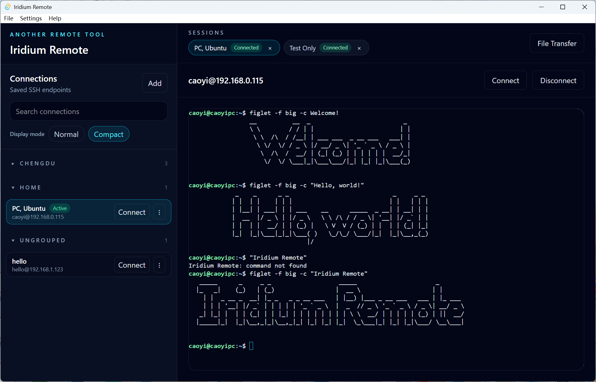

# Iridium Remote

English | [简体中文](README.zh-CN.md) | [繁體中文](README.zh-TW.md)

Iridium Remote is a desktop SSH client with equal first-class support for **Windows**, **Ubuntu (Linux)**, and **macOS**, built with **Tauri**, **React**, and **Rust**. It combines saved connections, tabbed terminal sessions, optional keyring-backed passwords, and SFTP file transfer in a single desktop app.

## Overview

Iridium Remote is designed for a practical desktop workflow:

- save and organize SSH connections
- open multiple terminal sessions in tabs
- keep passwords in the system keyring instead of SQLite
- transfer files with SFTP from the same app
- persist user preferences such as theme, language, and sidebar layout

**Windows**, **Ubuntu (Linux)**, and **macOS** are treated as equal first-class supported platforms, and release automation publishes installable builds for all three.

## Feature Summary

| Area | What it includes |
| --- | --- |
| **Connection management** | Create, edit, duplicate, delete, group, search, import, and export saved SSH connections |
| **Terminal sessions** | PTY-backed system `ssh`, multiple concurrent tabs, per-tab isolated I/O, tab switching without replaying unwanted input, prompt detection that clears the connecting state for common shell themes |
| **Connection UX** | Collapsible groups, normal/compact sidebar modes, right-click actions in compact mode, double-click to open a new session |
| **Authentication** | Optional password saving in the OS keyring, terminal-native password prompts, Linux Secret Service keyring support, and non-interactive SSH key auth when system SSH config allows it |
| **File transfer** | Upload/download files and directories, local file/folder pickers, remote SFTP path browser |
| **Preferences** | Light/dark theme, English / Simplified Chinese / Traditional Chinese, persisted sidebar state and display mode |
| **Reliability** | Clear session status updates, immediate connection failure feedback, disconnect detection when the SSH process exits, session cleanup on close, single-instance desktop behavior |
| **Data safety** | Passwords are never stored in SQLite and are never included in exported backup files |

## Detailed Features

### Connection library

- Save SSH hosts with name, host, port, username, and optional group
- Suggest existing groups while still allowing freeform group names
- Search by connection name, host, or username
- Collapse or expand connection groups
- Switch the sidebar between normal and compact display modes
- Single-click a connection to focus its open tab when one already exists, or just highlight it when no session is open
- Import/export JSON backups that include:
  - application settings
  - saved connection metadata
  - **never** saved passwords

### Terminal workspace

- Open multiple SSH sessions at the same time
- Switch between sessions with tabs
- Keep the left sidebar highlight in sync with the active session tab
- Restore each tab's terminal buffer independently
- Double-click a connection row to open a fresh session tab
- Use a localized terminal context menu for copy, paste, and select-all
- Stop the connecting state immediately when OpenSSH reports a startup failure
- Detect common shell prompt styles so a successful login switches the tab from `Connecting` to `Connected` promptly

### Authentication and security

- Use the system OpenSSH `ssh` client for terminal sessions
- Keep password prompts inside the terminal instead of showing a custom password dialog
- Optionally save passwords in the system keyring
- Use the desktop Secret Service keyring backend for saved passwords on Linux and Ubuntu builds
- Support saved-password auth and non-interactive SSH-key auth where available

### File transfer

- Upload files or directories
- Download files or directories
- Choose local paths with native dialogs
- Browse remote files and folders through the built-in SFTP picker
- Reuse saved connection metadata and available credentials

### Desktop UX

- Light and dark themes across the app UI
- Desktop Settings menu for language and theme selection, with theme-aware in-app selectors in the left sidebar for browser-only fallback mode
- Theme-aware sidebar scrollbar styling
- English, Simplified Chinese, and Traditional Chinese UI
- Manual update checks from **Help -> Check for Updates...** against the latest GitHub release, with a release-page download link when a newer version exists and an in-app banner that auto-dismisses after about 5 seconds
- Single-instance desktop behavior that focuses the existing window on relaunch
- Application logging to the app log directory

## Architecture

| Layer | Implementation |
| --- | --- |
| **Frontend** | React + TypeScript + Tailwind CSS + xterm.js |
| **Desktop shell** | Tauri |
| **Backend** | Rust |
| **Connection storage** | SQLite |
| **Credential storage** | OS keyring |
| **Terminal transport** | System OpenSSH `ssh` |
| **File transfer transport** | `russh` + `russh-sftp` |

## Repository Guide

| Path | Purpose |
| --- | --- |
| `doc\requirement.md` | Product requirements and backlog |
| `doc\ui-design.md` | UI structure and interaction design |
| `doc\technical-design.md` | Runtime architecture and implementation behavior |
| `doc\data-model.md` | Persistence model and backup format |
| `doc\frontend-backend-contracts.md` | Tauri commands and runtime events |
| `doc\development-setup.md` | Cross-platform development environment setup guide |
| `doc\tutorial.md` | Codebase walkthrough |

## Development

### Requirements

- Node.js with npm
- Rust toolchain
- Tauri desktop development prerequisites
- A supported desktop environment on Windows, macOS, or Ubuntu

### Commands

| Task | Command |
| --- | --- |
| Install dependencies | `npm install` |
| Run frontend only | `npm run dev` |
| Run desktop app in development | `npm run tauri -- dev` |
| Lint | `npm run lint` |
| Test | `npm run test` |
| Build frontend assets | `npm run build` |
| Check Rust backend | `cargo check --manifest-path src-tauri\Cargo.toml` |
| Build desktop app | `npm run tauri -- build` |

## Releases

- Cross-platform release publishing is defined in `.github\workflows\release.yml`.
- Push a version tag such as `v0.1.3` to trigger the GitHub Actions release pipeline.
- Published assets cover:
  - Windows: NSIS installer and MSI package
  - macOS: Apple Silicon and Intel app / DMG bundles
  - Ubuntu: `.deb` and `.AppImage`

## Notes

- **Windows**, **Ubuntu (Linux)**, and **macOS** are equal first-class supported platforms.
- Browser-only development mode remains available for UI work through the mock frontend client.
- Debug builds on Windows may show a console window; release builds hide it.
- Release installers are produced by `npm run tauri -- build`.

## License

This project is licensed under the [Apache License 2.0](LICENSE).

  

