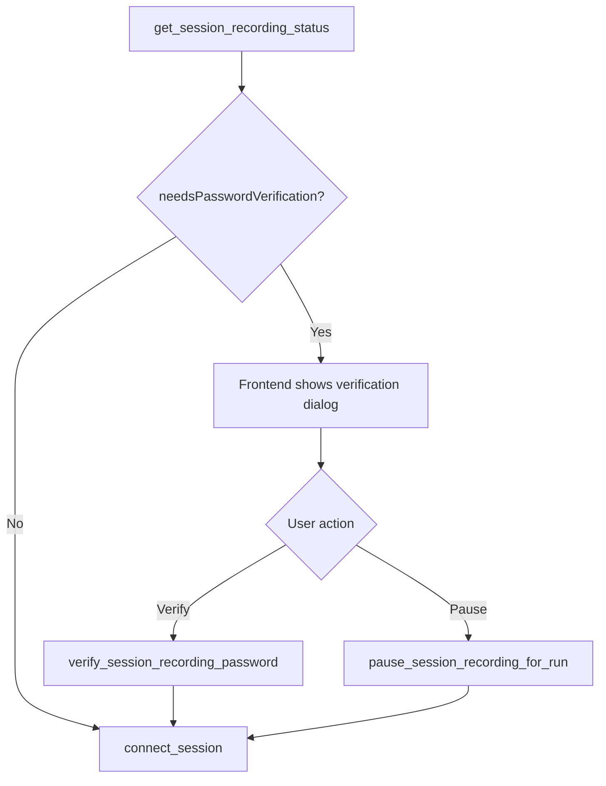

# Frontend / Backend Contracts

## Overview

The React frontend communicates with the Tauri backend through typed commands and runtime events exposed by `src\api\client.ts`.

## Connection commands

### `list_connections() -> ConnectionRecord[]`

Returns all saved connections. The `hasPassword` field comes from persisted non-secret metadata, so listing connections does not require a live keyring lookup.

### `create_connection(input) -> ConnectionRecord`

Creates a connection record and optionally stores a password in the keyring.

### `update_connection(input) -> ConnectionRecord`

Updates the connection record and synchronizes keyring password state.

### `delete_connection(id) -> void`

Deletes the connection record and removes any stored password for that connection identity.

## Settings commands

### `get_app_settings() -> AppSettings`

Returns persisted user preferences.

### `update_app_settings(settings) -> AppSettings`

Stores and returns the normalized settings payload.

### `get_session_recording_status() -> SessionRecordingStatus`

Returns the current runtime recording status:

- `configuredEnabled`
- `passwordConfigured`
- `passwordLoaded`
- `canRecord`
- `pausedForRun`
- `needsPasswordVerification`
- `logDirectory`
- `currentStorageBytes`

### `update_session_recording_settings(settings, password?) -> UpdateSessionRecordingSettingsResult`

Stores the session-recording settings, updates the runtime password when supplied, updates the persisted password verifier when a new password is supplied, and returns:

- `appSettings`
- `status`

`settings` also carries the optional custom `logDirectory` path that becomes the effective recording directory when non-empty. When recording is enabled and `password` is omitted, the backend keeps the existing verifier if one is already configured, so users can save other recording settings without re-entering and confirming a new password.

### `verify_session_recording_password(password) -> SessionRecordingStatus`

Validates the existing recording password for the current app run, loads it into runtime memory, clears any pause-for-run flag, and returns the updated status.

### `pause_session_recording_for_run() -> SessionRecordingStatus`

Marks recording as paused for the current app run only, clears the runtime password, and returns the updated status.

## Import / export commands

### `export_connections() -> ConnectionsExportPayload`

Returns the JSON-serializable backup payload for app settings plus all saved connections. In Tauri builds, the frontend uses this payload after the user chooses a destination in the native save dialog.

### `write_export_file(path, payload) -> void`

Writes the pretty-printed JSON backup payload to the user-selected path.

### `import_connections(payload) -> ImportConnectionsResult`

Merges the supplied backup payload into the local database and returns:

- `imported`
- `skipped`
- `settingsApplied`

## Session commands

### `connect_session(connectionId) -> SessionState`

Starts an SSH session for the selected connection. If recording is enabled but the current app run still needs password verification, the command returns a validation error and the frontend must resolve that recording gate first.

### `write_session_input(sessionId, data) -> void`

Writes terminal input to the target PTY session.

### `resize_session(sessionId, cols, rows) -> void`

Updates the PTY size to match the xterm viewport.

### `disconnect_session(sessionId) -> SessionState`

Stops the active SSH process for the session and returns the disconnected session state payload.

### `close_session(sessionId) -> void`

Removes the target session from the backend session list and releases backend resources.

### `get_session_states() -> SessionState[]`

Returns the currently tracked session snapshots on startup so the frontend can restore open tabs.

Each `SessionState` may also include:

- `recordingActive`
- `recordingMode?`

### `get_session_terminal_buffer(sessionId) -> string`

Returns the buffered PTY output for the requested session so the frontend can replay any early SSH text that appeared before the runtime event listener finished attaching. This is especially important for first-connection prompts such as host-authenticity confirmation and password entry.

## Connection history commands

### `get_connection_history_overview(range) -> ConnectionHistoryOverview`

Returns host-level connection-history summaries for the requested range:

- `last_7_days`
- `last_30_days`
- `last_90_days`
- `all_time`

Each host summary includes:

- `historyKey`
- `connectionId`
- `connectionName`
- `host`
- `port`
- `username`
- `deleted`
- `latestConnectionAt`
- `totalConnectionCount`
- `totalDurationSeconds`

### `get_connection_history_host_details(historyKey, range) -> ConnectionHistoryHostDetails`

Returns the selected host summary plus:

- `sessions`
- `durationBuckets`
- `summarizedSessionCount`
- `summarizedDurationSeconds`

`durationBuckets` uses these fixed bucket identifiers:

- `under_5_minutes`
- `between_5_and_30_minutes`
- `between_30_minutes_and_2_hours`
- `over_2_hours`

### `check_for_updates() -> UpdateCheckResult`

Queries GitHub from the backend for the latest release and returns:

- `currentVersion`
- `latestVersion`
- `updateAvailable`
- `downloadUrl?`

## Session log commands

### `preview_session_logs(paths, password) -> SessionLogPreview`

Decrypts one or more `.irlog` files and returns:

- `files`
- `previewText`
- `truncated`

### `export_session_logs(paths, password, outputPath) -> void`

Decrypts one or more `.irlog` files and writes the combined plain-text export to `outputPath`.

### `open_session_logs_directory() -> void`

Opens the configured session-log directory in the host OS file explorer.

## File transfer commands

### `transfer_file(input) -> FileTransferResult`

Runs an upload or download through the backend `russh`-based SFTP client.

- Upload accepts a local file or local directory.
- Download accepts a remote file or remote directory.
- File transfers may target either a directory path or a specific file path rename when the source is a file.
- Directory transfers require the destination side to be a directory.
- The desktop runtime should support both saved-password auth and non-interactive SSH-key auth for transfers.

### `list_remote_directory(connectionId, path?) -> RemotePathListing`

Lists remote files and folders for the lightweight SFTP-backed remote path browser used by the transfer dialog. Entries whose names start with `.` are omitted by default. The desktop runtime should support both saved-password auth and non-interactive SSH-key auth for this lookup, and return an explicit error instead of hanging when the remote host cannot complete the listing.

## Runtime events

### `terminal-output`

Payload:

- `sessionId`
- `stream`
- `data`

### `session-status`

Payload:

- `sessionId`
- `connectionId`
- `connectionName`
- `status`
- `message?`

The backend emits this event both for terminal-output-driven transitions such as `connecting -> connected` and for direct SSH-process exit transitions such as `connected -> disconnected` after a remote shutdown.

### `session-removed`

Payload:

- `sessionId`

Used by the frontend to remove closed tabs and clean up buffered output.

## Frontend-only bridge helpers

`src\api\client.ts` also exposes a few frontend helpers around the raw Tauri commands:

- `saveExportConnections(payload)` opens the native save dialog in Tauri builds, then calls `write_export_file`.
- `pickTransferLocalPath(direction, selectionMode, currentLocalPath, currentRemotePath)` opens the native file or folder picker used by the transfer dialog.
- `checkForUpdates()` calls the Tauri `check_for_updates` command in desktop builds and falls back to a direct GitHub lookup only outside Tauri.
- `pickSessionLogFiles()` opens the native multi-file picker for `.irlog` files.
- `pickSessionLogDirectory()` opens the native directory picker for a custom recording directory.
- `exportSessionLogs()` opens the native save dialog for the exported `.txt` file before calling `export_session_logs`.

## Browser mock behavior

When the app is not running inside Tauri:

- connections are mocked in memory
- settings are persisted via browser storage
- sessions are simulated
- session recording settings, persisted verifier state, and runtime password / pause-for-run state are simulated in memory
- connection history is simulated in memory and finalized when mock sessions close
- import/export works against the mock store, including settings when present
- exports fall back to the browser download flow because the Tauri native save dialog is not available
- local transfer-path picks return mock file or folder paths
- remote browsing returns mock remote directory entries
- session-log preview and export use the mock in-memory log store

This keeps `npm run dev` useful for UI development without the Rust runtime.
