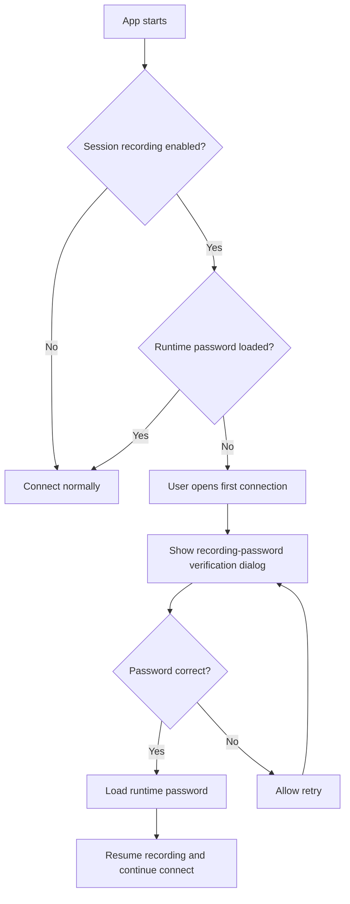
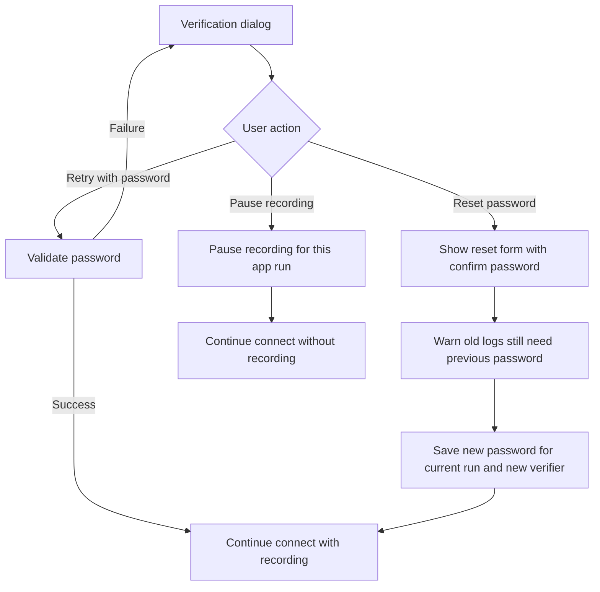
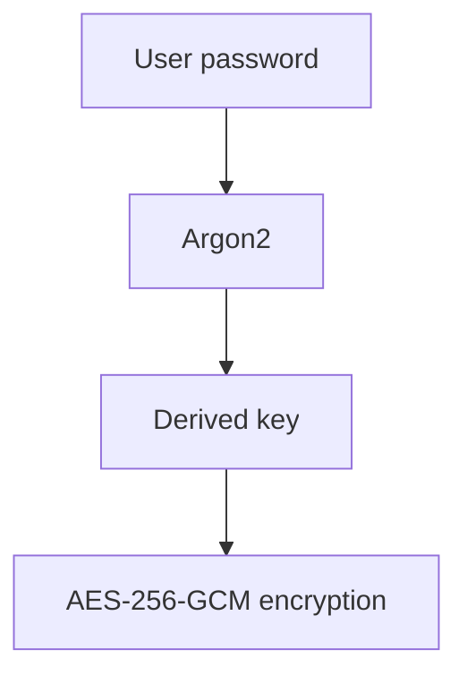
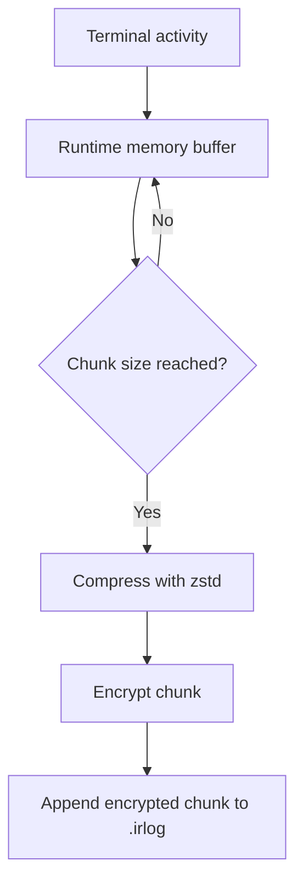

# Iridium Remote - Session Recording Requirements (V1)

## 1. Feature Overview

Implement an optional Session Recording feature for SSH sessions.

The purpose of this feature is to allow users to securely record terminal activity for:

* Auditing
* Troubleshooting
* Operational review
* Learning and replay

This feature is disabled by default.

---

# 2. Design Principles

* Security first
* Explicit user consent
* Local-only storage
* Minimal configuration complexity
* Stable long-running recording
* No plaintext logs on disk

---

# 3. Recording Rules

## 3.1 Recording Scope

Only content visible in the terminal UI may be recorded.

The system MUST NOT record:

* Password input
* Hidden characters
* Masked terminal input
* Non-visible terminal content

Examples:

* SSH password prompts
* sudo password input
* Any hidden terminal input mode

If characters are not displayed in the terminal window, they MUST NOT be recorded.

---

# 4. Recording Modes

The application supports the following recording modes:

## Disabled

No session recording.

---

## Input Only

Record only user-entered commands.

Examples:

```text id="vhtr7v"
ls
cd /var/log
docker ps
```

Terminal output is NOT recorded.

---

## Full Session Recording

Record:

* User input
* Terminal output

This mode may capture sensitive information displayed in the terminal.

The application MUST display a warning before enabling this mode.

Example warning:

```text id="ljjlwm"
Full session recording may capture sensitive information,
including secrets or confidential data displayed in terminal output.
```

---

# 5. Settings Menu

## Menu Structure

```text id="3yupae"
Settings
  └── Session Recording
```

In the Settings menu, `Session Recording` should appear after the existing Language and Theme items.

---

# 6. Session Recording Settings

## 6.1 Enable Recording

```text id="u4mnzl"
[ ] Enable Session Recording
```

Disabled by default.

When unchecked, all other controls in the Session Recording dialog should be disabled visually and functionally.

---

## 6.2 Recording Mode

```text id="6thqga"
( ) Input Only
( ) Full Session Recording
```

Default:

* Input Only

---

## 6.3 Encryption Password

When the user is setting a new recording password for the first time, or explicitly resetting it, the dialog must require:

* Encryption Password
* Confirm Password

Requirements:

* Minimum length: 8 characters

If an existing password has already been configured, users may leave these fields blank when they are only changing other recording settings and do not want to replace the password.

The password is used to encrypt session log files.

The application MUST NOT permanently store this password.

If a password is already loaded for the current app run, the password field should show a masked placeholder such as `********` instead of appearing empty.
If a password is already configured but not loaded after restart, the settings dialog may keep the password fields empty and defer the actual password check to the first-connection verification dialog.

---

## 6.4 Password Verification After Restart

If session recording remains enabled after the app restarts, the recording password is no longer loaded in runtime memory.

In that state:

* The first connection attempt MUST open a verification dialog
* The dialog MUST ask for the existing recording password only once
* The dialog MUST NOT force the user to enter `Confirm Password` unless the user explicitly chooses to reset the password



---

## 6.5 Wrong Password, Reset, and Pause

If verification fails, the application SHOULD explain that the password is incorrect and allow the user to:

* try again
* reset the password
* pause session recording for the current app run

If the user chooses **Reset Password**:

* The application MUST require:
  * Encryption Password
  * Confirm Password
* The application MUST warn that previously recorded logs still require the old password and cannot be opened with the new one

If the user chooses **Pause Recording**:

* Recording stays disabled only for the current app run
* The persisted `enabled` setting remains unchanged
* The next app restart MUST require verification again before recording resumes



---

# 7. Encryption Design

## 7.1 Encryption Algorithm

Use:

* AES-256-GCM

Reason:

* Modern authenticated encryption
* Integrity protection
* Industry-standard security

---

## 7.2 Key Derivation

The encryption password MUST NOT be used directly as an encryption key.

Use:

* Argon2

Flow:



---

# 8. Storage Policy

## 8.1 Max Log File Size

```text id="7bjlwm"
Max Log File Size
Default: 100 MB
```

When the size limit is reached:

* Automatically create a new rotated log file

Example:

```text id="ks4r0i"
2026-05-16_14-32-08_root_server01_part01.irlog
2026-05-16_14-32-08_root_server01_part02.irlog
```

---

## 8.2 Max Total Storage

```text id="4v6w74"
Max Total Storage
Default: 5 GB
```

When the storage limit is reached:

* Automatically delete oldest log files

(FIFO strategy)

---

## 8.3 Retention Period

```text id="j3u8tm"
Retention Period
Default: 30 days
```

Expired log files are automatically deleted.

---

## 8.4 Log Directory

```text id="uw6ltj"
Directory
Default:
%LOCALAPPDATA%\Iridium Remote\SessionLogs
```

Recommended actual path:

```text id="5lfjlwm"
C:\Users\<username>\AppData\Local\Iridium Remote\SessionLogs
```

The application SHOULD provide:

```text id="0d7d8g"
[ Open Folder ]
```

button for convenience.

Users should also be able to customize the log directory path from the Session Recording dialog.

---

## 8.5 Current Storage Usage

Display current storage usage.

Example:

```text id="wpxd0m"
2.1 GB used
```

---

# 9. Session Recording Lifecycle

## 9.1 Session Start

When:

* Session recording is enabled
* SSH session becomes active

The application starts collecting session data.

---

## 9.2 Recording Pipeline

To avoid excessive memory usage and plaintext disk writes:

The application uses chunk-based encrypted streaming.

Flow:



---

## 9.3 Chunk Size

Recommended default:

```text id="n08g0f"
1 MB
```

Each chunk is:

* Independently encrypted
* Written directly to disk after encryption

This design:

* Prevents excessive memory usage
* Avoids plaintext disk writes
* Improves crash recovery

---

# 10. Compression

Before encryption:

* Compress session data

Recommended:

* zstd
  or
* gzip

---

# 11. Log File Format

## Extension

```text id="fqjlwm"
.irlog
```

Example:

```text id="szhtp6"
2026-05-16_14-32-08_root_server01.irlog
```

---

## File Structure

```text id="fp5es7"
Header
Metadata
Encrypted Chunks
```

---

## Metadata (plaintext)

Example:

```json id="vqjlwm"
{
  "version": 1,
  "host": "192.168.1.10",
  "username": "root",
  "recording_mode": "input-only",
  "created_at": "2026-05-16T14:32:08Z"
}
```

Metadata MUST NOT contain:

* Passwords
* Encryption keys
* Sensitive secrets

---

# 12. Session Log Viewer

## Workspace Structure

```text id="4i08z5"
Sidebar Tabs
  ├── Connections
  ├── History
  └── Logs
```

---

# 13. Open Session Logs

Users can:

* Open the `Logs` workspace
* Browse discovered log sources and one or multiple `.irlog` files
* Enter encryption password
* Decrypt logs
* Export logs
* Leave and return while keeping the selected source/files but clearing the entered password and decrypted preview

---

# 14. Export Format

Supported export format:

```text id="8rzjlwm"
.txt
```

---

# 15. Recording Status Indicator

When recording is active, the UI SHOULD display:

```text id="zjlwm8"
● Recording
```

or:

```text id="qbpkmm"
● Input Recording
```

This indicator helps ensure transparency and user awareness.

---

# 16. Security Requirements

The application MUST NOT:

* Store plaintext passwords
* Store encryption passwords permanently
* Record hidden terminal input
* Write unencrypted session logs to disk

---

# 17. Warning Message

The application SHOULD display:

```text id="2i8sjc"
Session recording may capture sensitive information.
Users are responsible for compliance and data protection.
```

---

# 18. Out of Scope (V1)

The following features are NOT included:

* Cloud sync
* Remote upload
* Real-time playback
* Search indexing
* Team audit system
* Shared logs
* Key file encryption support
* Online log streaming

---

# 19. Definition of Done

The feature is considered complete when:

* Users can enable or disable session recording
* Input-only recording works correctly
* Full session recording works correctly
* Hidden/password input is never recorded
* Logs are encrypted successfully
* Logs can be decrypted and exported
* Log rotation works correctly
* Old logs are cleaned automatically
* No plaintext logs remain on disk
* Large sessions remain stable without excessive memory usage
