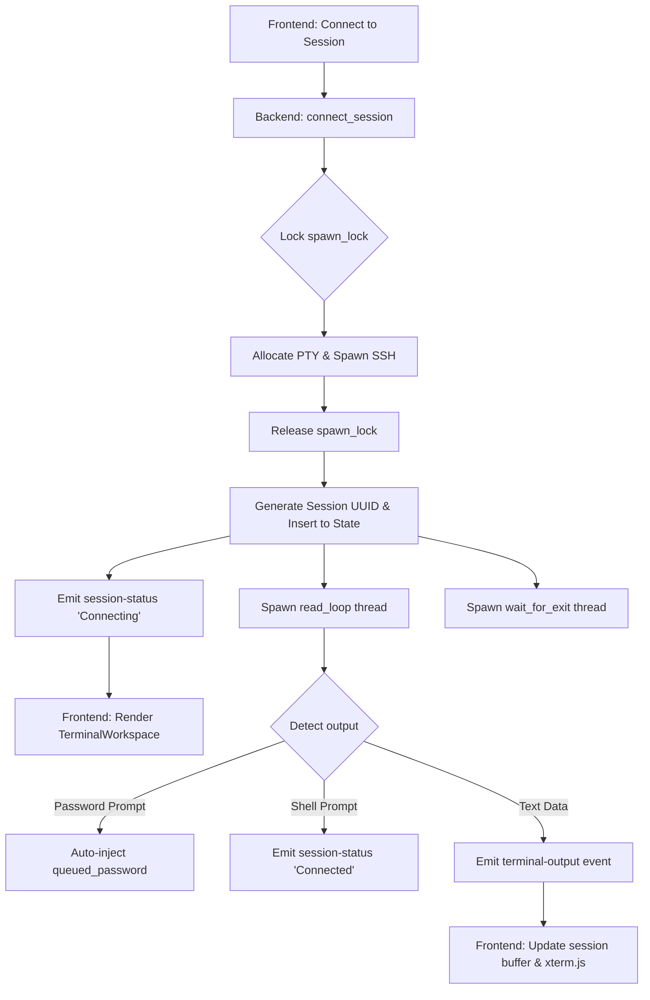
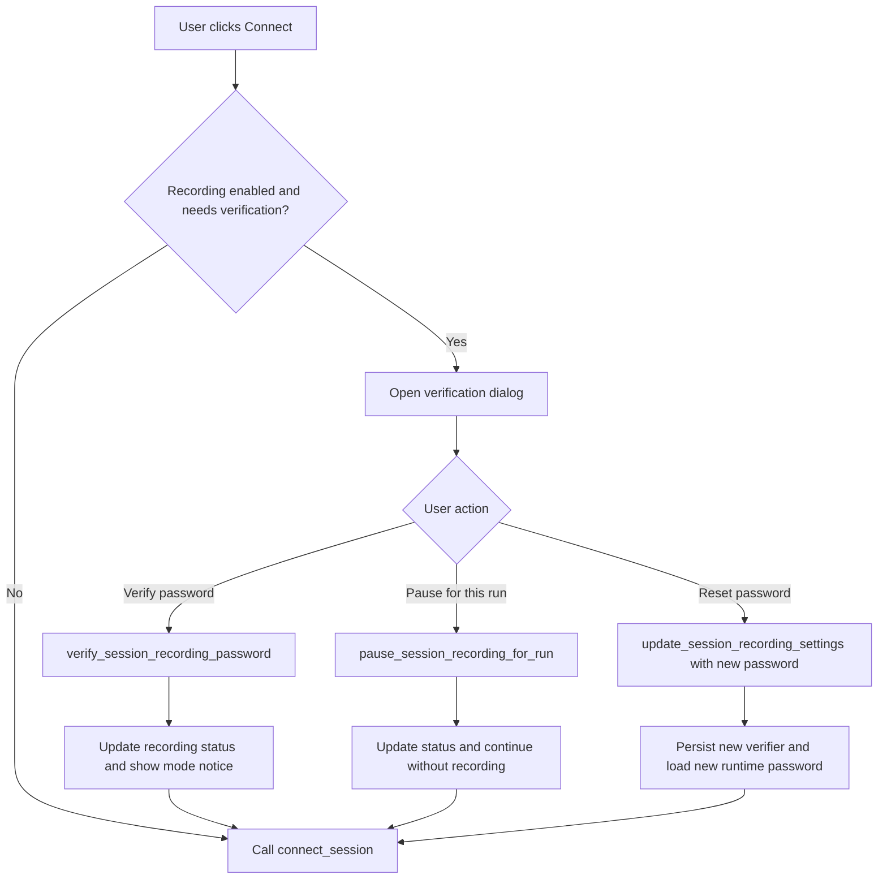

# Technical Design Document

## Overview

Iridium Remote is a split frontend/backend desktop application:

- **React frontend** renders the connection manager, sidebar workspaces, dialogs, menus, and terminal host surface.
- **Tauri backend** exposes commands, manages persistence, launches SSH sessions, opens SFTP clients, and emits session events.
- **SQLite** stores connection metadata and app settings.
- **System keyring** stores passwords.
- **System OpenSSH `ssh`** provides terminal-session transport.
- **`russh` + `russh-sftp`** provide file transfer and remote-browser transport.

## Frontend architecture

### Main shell

`src\App.tsx` owns:

- loading connections and app settings
- loading session-recording runtime status
- tracking the active top-level workspace and delegating history/log workspace queries through the bridge
- menu registration
- dialog visibility
- active session selection
- import/export flow
- notice/error banners

It also derives the sorted unique group list used by the connection dialog so the group field can suggest existing groups while remaining freeform. Group names are normalized case-insensitively into a shared Title Case form before they are stored or grouped in the UI.
In packaged desktop builds, `src\App.tsx` registers a top-level Settings menu that keeps Session Recording as the last action after Language and Theme, while the File menu is limited to connection import/export actions plus exit. The shell uses a shared left sidebar with always-on `Connections` and `History` tabs plus a conditional `Logs` tab that appears only when session recording is enabled. Browser-only mock mode keeps inline Language and Theme controls in the active sidebar area because it does not have the native desktop application menu available.

### Sidebar

`src\components\ConnectionList.tsx` renders:

- the product branding block at the top of the sidebar
- the shared workspace-tab strip supplied by the parent
- browser-only fallback settings controls supplied by the parent
- search query state from the parent
- display mode switch
- collapsible grouped connections
- per-connection actions

Collapsed groups are persisted through app settings rather than local-only UI state.
Collapsed group keys use the same normalized group name format so saved collapse preferences still match after case-only edits.
The independently scrolling sidebar list uses theme-aware scrollbar styling so light and dark mode stay visually consistent even when the host OS default scrollbar colors differ from the app theme.
Filtering is done in the frontend in real time against connection name, host, and username. Double-clicking a connection row opens a fresh session tab for that saved host. Single-click selection is coordinated in `src\App.tsx`: when the clicked connection already has an open session, the app activates that tab; otherwise it only changes the sidebar highlight. Session-to-sidebar synchronization also expands a collapsed group automatically when tab selection moves to a connection inside that group. In compact mode, the sidebar renders a `⋮` popup menu for edit/copy/delete actions instead of inline buttons, and the same menu is opened by right-clicking a connection row. In normal mode, connection rows do not open a custom context menu.

### Terminal workspace

`src\components\TerminalWorkspace.tsx` manages:

- tab rendering for active sessions
- active workspace header title and actions
- xterm host container
- transfer action access
- empty-state rendering

The layout uses `min-h-0` and overflow boundaries so the main window does not become the scroll container. `src\App.tsx` suppresses the default browser-like context menu across the shell, and `src\components\TerminalWorkspace.tsx` replaces the terminal area's native browser menu with a custom localized, theme-aware menu for terminal actions. The same component also owns a separate tab-strip context menu, but it is intentionally limited to only two actions: closing the clicked tab or closing all of the other tabs.
The horizontally scrolling tab strip also uses theme-aware scrollbar styling so the right workspace stays visually aligned with the active light or dark theme, and its tab chrome is rendered as a lightly stacked folder-like strip instead of flat pills. Inactive tabs expose their SSH target through the native `title` tooltip so users can disambiguate duplicate saved names without switching tabs.
Per-session terminal history is buffered on the frontend for fast tab restoration, but replay-only buffers strip terminal status-query escape sequences so activating a tab does not send synthetic input back to the SSH session. Tab activation also updates the selected connection in the sidebar so the left panel stays synchronized with the active workspace session. Tab close actions are still split between single-tab closes and batch close requests so `src\App.tsx` can reuse its existing session teardown flow for `Close Tab` and `Close Other Tabs` from the tab menu without duplicating shutdown logic. Runtime `session-status` events and late async `connectSession` completions now update session data without auto-switching away from whatever tab the user is already watching; only the active session, an explicitly selected tab, or the first session after an empty workspace may drive focus changes. While a session is still connecting, the frontend also re-syncs the backend PTY snapshot on a short interval so host-key prompts, saved-password flows, and fast key-based logins still repopulate xterm even if an early live output event was missed. That short resync window now continues briefly after a session flips to `connected` if the visible buffer is still empty, which makes shell prompts recover even when the initial prompt lands right on the `connecting` -> `connected` transition. Background sessions now also synthesize minimal replies for common terminal queries such as cursor-position requests while they are not the visible tab, so shells that probe the terminal during startup do not hang waiting for a response that only the active xterm instance could otherwise provide. Initial xterm fitting is now deliberately conservative: the frontend can fit the local viewport immediately for rendering, but it defers PTY resize commands until the active session has visible terminal output, and the backend still refuses PTY resize requests smaller than `2x2` so an early bad fit cannot collapse a live SSH session into a blank cursor state.
The workspace header itself is intentionally minimal: it shows only the active SSH target in `username@host[:port]` format and does not repeat the saved connection name or render a separate status pill. When the active session is being recorded, the same header shows a compact recording badge so users always know when capture is active. The terminal surface is never obscured while a session is still in `connecting`; pre-shell SSH interactions such as host-key confirmation and password prompts must remain visible and usable inside xterm until the backend detects a real remote shell prompt.
The session-log preview textarea reuses the same theme-aware scrollbar classes as the sidebar and tab strip, and the session-recording dialog keeps the log-directory path plus browse/open actions on a single aligned input row at normal desktop widths.
`src\components\ConnectionHistoryWorkspace.tsx` and `src\components\SessionLogsWorkspace.tsx` reuse the same shell split but switch the right panel from terminal content to history statistics or log preview tools. The History workspace now separates aggregate cross-host views from per-host detail navigation in the left sidebar, and the Logs workspace keeps only source navigation on the left while moving per-source file selection into the right panel beneath the selected-log actions. Its right panel starts with a compact two-line log-directory summary, then aligns a stacked left column whose selected-log card now begins with a single-row password label+input, keeps decrypt/export actions directly underneath, and places the selected-log list in a lower read-only multiline field above the visible log files beside the persistent preview pane. Their React state remains alive across tab switches so selection/filter context is preserved, while the Logs workspace clears runtime decryption secrets when it becomes inactive.

### Frontend bridge

`src\api\client.ts` abstracts runtime access:

- Tauri mode calls backend commands
- browser mode uses a mock implementation for UI-only development

The mock now mirrors settings persistence, session-history recording, and import/export behavior closely enough for non-Tauri development. In packaged Tauri builds, the manual update check runs through the Rust backend instead of a frontend-only fetch so GitHub requests are not blocked by browser-style constraints. The backend first tries the latest-release API with an explicit user agent and then falls back to the public `releases/latest` redirect page before returning the release download URL when a newer version is available. The frontend renders the resulting status in an in-app banner that auto-dismisses after about 5 seconds with a short exit transition.
In packaged Tauri builds, the app menu exposes File, Settings, and Help sections. File owns new/import/export/exit actions, while Settings owns Language, Theme, and a last-position Session Recording action. The bridge also exposes connection-history overview/detail queries, session-log discovery, session-recording status, settings updates with runtime-only passwords plus persisted password-verifier state, first-connect password verification, pause-for-run control, decrypt previews, export, log-directory picking, and log-directory opening.

## Backend architecture

### Command surface

`src-tauri\src\lib.rs` registers commands for:

- connection CRUD
- session lifecycle and terminal I/O
- session recording status, verification/pause controls, settings, session-log discovery, decrypt preview, export, and directory opening
- file transfer
- app settings load/update
- connection export/import

It also configures logging and starts shared application state.
The desktop runtime also registers a single-instance guard so a second launch focuses the existing `main` window instead of creating another long-lived desktop instance.

### Database layer

`src-tauri\src\database.rs` now owns four persistence concerns:

1. `connections`
2. `app_settings`
3. `connection_history_sessions`
4. `connection_history_rollups`

Connection rows are stored directly in SQLite. App settings are stored as a serialized `AppSettings` JSON payload under the `app` key and materialized into a typed `AppSettings` value for the frontend. Session-recording preferences, including the optional custom log-directory path, live inside that payload. The recording password itself remains runtime-only and is never persisted, but the backend now stores a separate Argon2 password-verifier string under `session_recording_password_verifier` so a restarted app can ask the user to verify the existing password before recording resumes.
Connection history uses a detail-plus-rollup model: the backend inserts a running detail row as soon as SSH launch succeeds, throttles `last_activity_at` while the session is active, recovers unfinished rows as abnormal estimated sessions on startup, and rolls detail rows older than 365 days into monthly host rollups that preserve total counts, total duration, latest activity, and duration-bucket counts for all-time charts. Range-filtered history queries now include still-running detail rows by computing their current duration from `started_at` to `now`, while all-time rollups remain limited to finalized rows.

### Session manager

`src-tauri\src\session.rs` manages multiple concurrent PTY-backed SSH sessions keyed by `session_id`.

Responsibilities:

- launch `ssh`
- serialize PTY allocations and process spawns to prevent concurrency bugs on Windows (`spawn_lock`)
- stream output events
- receive terminal input and resize events
- detect session exit
- keep session output isolated by tab
- attach an optional recorder when session recording is enabled
- persist connection-history lifecycle updates without blocking SSH startup

Password prompts remain terminal-native; the backend no longer opens a custom password dialog.
When a saved password exists, the session manager queues it and writes it back into the PTY after detecting a password prompt in the terminal output stream.
The same output stream is inspected for immediate OpenSSH connection failures so a failed session can switch from `connecting` to `error` quickly and surface the SSH error text instead of leaving the loading state running. The prompt detector also recognizes a wider range of shell prompt endings, including common themed Unicode prompts, so successful logins do not remain stuck in the `connecting` state after the shell becomes interactive.
The backend also watches the SSH child-process lifecycle directly instead of relying only on PTY reads, so a tab can switch from `connected` to `disconnected` promptly when the remote host shuts down and the SSH process exits without delivering more terminal output through the PTY stream. PTY resize handling is defensive as well: the backend ignores frontend resize requests smaller than `2x2` and keeps the safe default PTY size from session creation until a real xterm viewport is available. For input-only recording, the session manager records submitted command lines while suppressing password-prompt input; for full-session recording, it records visible terminal output after ANSI cleanup. The same manager now creates connection-history rows, throttles `last_activity_at` updates, finalizes rows as normal or abnormal, and triggers history cleanup after sessions finish.

### Session recording

`src-tauri\src\recording.rs` owns the encrypted session-recording pipeline.

Responsibilities:

- keep the recording password in runtime memory only
- keep a persisted password verifier that can validate the existing password after restart without storing the password itself
- create the session-log directory and report current storage usage
- derive AES-256-GCM keys from the user password through Argon2
- compress visible session text with zstd before encryption
- write independently encrypted chunks into `.irlog` files
- rotate files at the configured size
- delete old files when retention or total-storage limits are exceeded
- decrypt selected `.irlog` files for preview and `.txt` export

The frontend gates the first post-restart connection when recording is enabled but no runtime password is loaded.

### Credentials

`src-tauri\src\credentials.rs` routes password storage to the operating system keyring. Windows builds use Credential Manager directly, while non-Windows builds initialize the `keyring` crate against the desktop native store and force Linux/Ubuntu builds onto the Secret Service backend instead of the kernel keyutils store so saved passwords behave like a normal desktop keyring feature. Connection rows also persist a non-secret `has_password` flag in SQLite so startup and connection-list rendering do not need to read the keyring; actual keyring reads are deferred until a password is saved, removed, or actively used for connect / transfer work.

### File transfer

`src-tauri\src\transfer.rs` uses a `russh` + `russh-sftp` client flow instead of shelling out to the system `sftp` binary.
The transfer dialog uses Tauri's native file dialogs for local file/folder selection and a lightweight SFTP-backed remote path listing command for browsing remote files and folders. The remote browser filters out dot-prefixed hidden entries by default. Transfers and remote browsing support saved-password auth plus non-interactive SSH-key auth through standard SSH config and identity files, remote directory transfers recurse through the SFTP client, and the remote work runs asynchronously with explicit timeouts so a slow or misbehaving host does not freeze the app window.

## Settings persistence

Persisted settings currently include:

- locale
- theme
- connection list display mode
- collapsed group keys
- session recording settings except the encryption password

The frontend treats backend settings as the source of truth so preferences survive restarts in both packaged and local runs.

## Import and export design

Exports produce a JSON document containing:

- schema version
- exported timestamp
- app settings
- connection records

In Tauri builds, the frontend opens the native save dialog so the user can choose the destination path and filename before the backup JSON is written.

Imports merge into the existing library:

- settings are restored when present in the backup
- passwords are ignored
- duplicates are skipped using a normalized signature
- the result payload returns counts for imported and skipped entries plus whether settings were restored
- browser-only development keeps the simpler download fallback because it does not have access to Tauri's native save dialog

## Logging

The desktop runtime uses `tauri-plugin-log`.

- Application logs are written to the app log directory.
- Important operational actions emit structured log lines through the Rust backend.
- Debug builds can still surface log output in the development console path.
- External Help-menu links are opened through `tauri-plugin-opener` in Tauri builds, with explicit opener capability permissions.

## Release automation

- Cross-platform releases are published by GitHub Actions through `.github\workflows\release.yml`.
- The workflow is driven by version tags such as `v0.1.4`, and it verifies that the Git tag, `package.json`, `src-tauri\tauri.conf.json`, and `src-tauri\Cargo.toml` all use the same app version before publishing.
- An Ubuntu release job publishes `.deb` and `.AppImage` bundles.
- Windows release jobs publish the standard Tauri Windows bundles, and macOS release jobs publish separate Apple Silicon and Intel artifacts.

## Windows behavior

`src-tauri\src\main.rs` uses `windows_subsystem = "windows"` only for non-debug builds.

- debug runs may show a console window
- release builds and release installers hide it
- a second desktop launch focuses the existing main window instead of keeping another instance open

## Error handling

- Backend commands return explicit errors to the frontend.
- Import failures, transfer failures, and session failures become visible UI notices.
- The app avoids broad silent fallbacks for persisted data operations.
