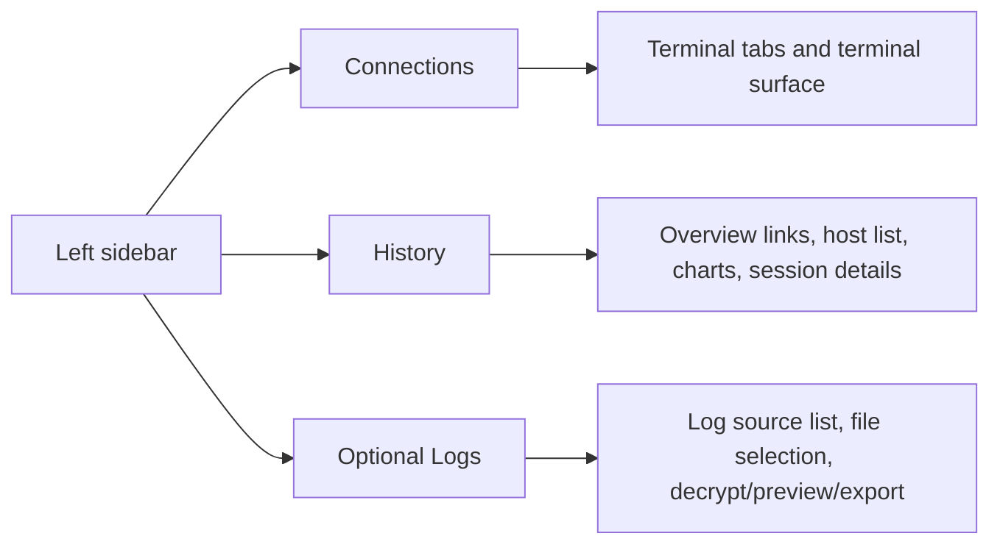

# UI Design Document

## Window structure

The main window uses a two-column layout:

- **Left sidebar:** product branding, workspace tabs, browser-only settings controls when needed, and the active workspace's navigator
- **Right workspace:** the active workspace surface (`Connections`, `History`, or `Logs` when session recording is enabled)

The window itself should not scroll. The sidebar scrolls independently, uses scrollbar styling that matches the active light or dark theme, and terminal scroll stays inside the xterm viewport.

## Sidebar top area

The top of the left sidebar contains:

- app tagline
- app title

In desktop builds, Language and Theme are not shown here because they live in the top-level Settings menu. Browser-only fallback mode may keep inline controls under the branding block because there is no desktop application menu there.

## Application menu

### File

- New Connection
- Import
- Export
- Exit

### Help

- ❤️ Star on GitHub
- Report Issue
- Check for Updates...
- About

### Settings

- Language
  - English
  - 简体中文
  - 繁體中文
- Theme
  - Dark
  - Light
- Session Recording

Selecting external-link items opens the user’s browser. Selecting About opens a modal dialog. Selecting Check for Updates checks the latest GitHub release and shows an in-app status message; when a newer version exists, that message includes an actionable release download link. The status banner auto-dismisses after about 5 seconds with a smooth fade-out.

## Sidebar design

The sidebar contains these layers in order:

1. **Branding block**
   - app tagline and app title
2. **Workspace tabs**
   - `Connections`
   - `History`
   - `Logs` only when session recording is enabled
   - visually styled like a lightly stacked folder/tab strip rather than flat segmented buttons
3. **Browser-only settings controls**
   - shown only outside the desktop runtime
   - language selector
   - theme selector
4. **Workspace-specific sidebar content**
   - `Connections`: search field, display mode control, grouped connection list
   - `History`: date-range filters, overall-statistics links, host search, host list
   - `Logs`: recording-directory actions and log-source list

### Normal mode

- One card-like row per connection
- Name is visually dominant
- Host, user, and metadata remain visible
- Primary actions are easy to reach

### Compact mode

- One dense row per connection
- Fewer secondary details
- Better for large connection libraries
- `Connect` stays visible while `Edit`, `Copy`, and `Delete` move into a small popup menu opened from a `⋮` button
- Right-clicking a connection opens the same compact popup menu

### Context menus

- The default browser-like context menu is suppressed across the app shell
- Right-clicking the terminal workspace opens a custom menu styled with the active app theme
- The terminal menu uses the active locale and should expose only relevant terminal actions such as copy, paste, and select all
- Right-clicking a session tab opens only two localized close actions for that tab: close the current tab and close the other tabs
- In normal mode, connection rows do not open a custom context menu

## Connection interactions

Each connection entry supports:

- connect
- edit
- duplicate
- delete

Single-clicking a connection row should keep that connection highlighted. If the connection already has an open session tab, the single click should also switch the workspace to that tab.
Double-clicking a connection row should open a new session tab for that connection immediately.
Switching to a session tab should update the highlighted connection row in the left sidebar and automatically expand its group if that group was collapsed.

File transfer is launched from the active workspace header for the currently selected connection, not from each sidebar row.

Search results should temporarily reveal matching groups even if those groups were collapsed previously.

## Terminal workspace

The right side of the `Connections` workspace contains:

- terminal tab strip for active sessions, with inactive-tab hover tooltips showing `username@host[:port]`
- workspace header showing only the active SSH target in `username@host[:port]` format
- recording indicator when the active session is being recorded
- connect / disconnect actions for the selected connection
- file transfer action for the active connection
- active terminal area
- empty state when no session is active

Only the terminal viewport scrolls for terminal output. The tab strip scrollbar should follow the active theme when it overflows horizontally, and the tabs themselves should feel closer to a lightly stacked folder strip than three flat buttons. Inactive tabs should reveal the remote SSH target through a native hover tooltip so duplicate saved names are still distinguishable at a glance. Right-clicking a tab should open only two localized close actions: one for the clicked tab and one for all other tabs. Tab switching should immediately restore the selected session buffer without injecting any input into the active terminal. Background session status changes and late connection completions must not steal the active tab from the session the user is currently viewing, because rapid multi-tab connection attempts should still leave the workspace focused on the user-selected tab. If SSH startup fails, the connecting state must stop immediately and the workspace should show a clear error message for that session. During SSH startup, the terminal itself must remain visible and interactive so host-key confirmation and password prompts can be read and answered before the remote shell is marked `Connected`. If the initial shell prompt races with that state transition, the workspace should keep rehydrating the active tab from the backend snapshot until the terminal buffer is actually visible instead of leaving xterm blank. Inactive tabs should also keep background SSH startup moving by answering basic terminal capability and cursor-position probes even before the tab becomes visible. Initial terminal fitting should also tolerate layout races: the UI may fit xterm locally right away, but it should wait until the tab has visible terminal output before sending the first PTY resize to the backend, so a new tab does not get stuck with only a blinking cursor in the top-left corner.

Switching away from `Connections` must keep existing SSH sessions alive. Returning to `Connections` should restore the same terminal tabs and active session state.

## History workspace

The `History` workspace uses the shared left/right shell:

- **Left sidebar:** date-range quick filters, a collapsible `Overall statistics` section with links for `Cross-host duration share`, `Cross-host connection count share`, and `Daily usage`, plus a collapsible `Host statistics` section with host search, host list, and deleted-connection markers
- **Right panel:** whichever view matches the current left-side selection; overall share views pair the pie chart with a sortable host list that supports `By current metric` and `By latest connection` ordering plus proportional horizontal value bars, while host items show selected-host summary cards, duration-distribution charts, and recent session detail tables

Switching away from `History` and back should keep the previously selected host and active filters visible.

## Logs workspace

The `Logs` workspace appears only when session recording is enabled and uses the shared left/right shell:

- **Left sidebar:** recording-directory actions and discovered source list
- **Right panel:** a compact log-directory summary card, then a two-column content area where the left column shows an inline `Encryption password` label+field row, decrypt/export actions, a lower `Selected logs` block with clear-selection control plus read-only multiline file list, and then the per-source `.irlog` file list while the right column keeps the preview area

Switching away from `Logs` and back should keep the selected source and files, but must clear the decryption password and decrypted preview content.

## Dialogs

### Connection dialog

Used for create, edit, and duplicate flows.

Fields:

- name
- group
- host
- port
- username
- password (optional)

When saved groups exist, the group field uses a theme-aware suggestion list that lets the user pick an existing group or type a brand new one. Group names are normalized case-insensitively, stored in Title Case, and shown through the existing uppercase group-header presentation.

Password entry here is for optional keyring storage, not for runtime prompt handling.

### File transfer dialog

Supports upload and download flows with path entry, separate local file/folder browse buttons, a lightweight remote file browser, and status feedback. The remote picker can either select a file directly or return the current folder as a directory path, and it hides dot-prefixed hidden files and folders by default.

### About dialog

Shows:

- product name
- version
- author: Cao Yi
- project URL
- license

The project URL is an actionable link or button.

### Session recording dialog

Shows:

- enable toggle
- recording mode selection
- encryption password and confirmation fields
- password field uses a masked placeholder when a runtime password is already loaded
- storage policy fields for file size, total storage, and retention
- customizable log directory path with browse/open actions
- current storage usage
- open-folder action

When recording is disabled, all dependent controls below the enable toggle are disabled and visually dimmed.
The log-directory input and its browse/open actions should stay aligned on the same row in normal desktop widths.

The preview area's scrollbar should follow the active light or dark theme, just like the sidebar and terminal tab strip.

## Visual behavior

- Light and dark themes apply consistently across sidebar surfaces, sidebar scrollbars, terminal tab-strip scrollbars, dialogs, themed popup menus, and terminal shell framing.
- Language switching updates visible labels without changing layout structure.
- Notices for import/export results, settings changes, and operational errors appear inline near the top of the main window content.

## Shortcuts and Keybindings

The application supports a comprehensive set of keyboard shortcuts mapped to standard OS modifiers (`Ctrl` for Windows/Linux, `Cmd`/`⌘` for macOS).

### Global & Main Interface
- `Mod + N`: New Connection
- `Mod + ,`: Open Settings (including Shortcuts configuration)
- `Mod + K` / `Mod + P`: Open Quick Connect / Global Search
- `Mod + Shift + F`: Focus connection list search field
- `F11` / `Mod + Ctrl + F`: Toggle Fullscreen

### Modals & Dialogs
- `Esc`: Cancel / Close current topmost modal. In password prompts, this cancels the connection and closes the prompt.
- `Enter`: Confirm / Submit for single-line inputs (e.g., password prompt, confirmation dialogs).
- `Mod + Enter`: Save / Submit for complex forms (e.g., Edit Connection).
- `Mod + S`: Save changes in dedicated settings pages.

### Tabs & Terminal Management
- `Mod + W`: Close current terminal tab.
- `Mod + Shift + W`: Close all terminal tabs.
- `Mod + Tab` / `Mod + Shift + Tab`: Cycle through open terminal tabs.
- `Mod + 1` to `Mod + 9`: Switch to tab 1 through 9.
- `Mod + F`: Find in current terminal session.
- `Mod + =` / `Mod + -`: Zoom in / out terminal font.
- `Mod + 0`: Reset terminal font size.
- `Mod + Shift + C` / `Mod + Shift + V`: Copy / Paste within terminal.

### SFTP / File Manager
- `F5` / `Mod + R`: Refresh current directory.
- `F2`: Rename selected file/folder.
- `Delete` / `Mod + Backspace`: Delete selected file/folder.
- `Backspace`: Go to parent directory.

### Shortcuts Settings Page
A dedicated "Shortcuts" (or "Keyboard") tab is available in the global Settings modal. It includes:
- A top search box to filter actions by name.
- A list/table of categorized actions and their current keybindings.
- An interactive recording mode: clicking a shortcut row enables capturing the next key combination to rebind it.
- A reset action for each shortcut to restore its default binding.

The frontend uses `navigator.platform` or Tauri's OS detection to display the correct modifier key (`Ctrl` vs `⌘`) to the user. Terminal shortcuts (like `Mod + W`) are intercepted in xterm's `customKeyEventHandler` by returning `false` to prevent the terminal from swallowing the event, allowing it to bubble up to the global React event listeners.
